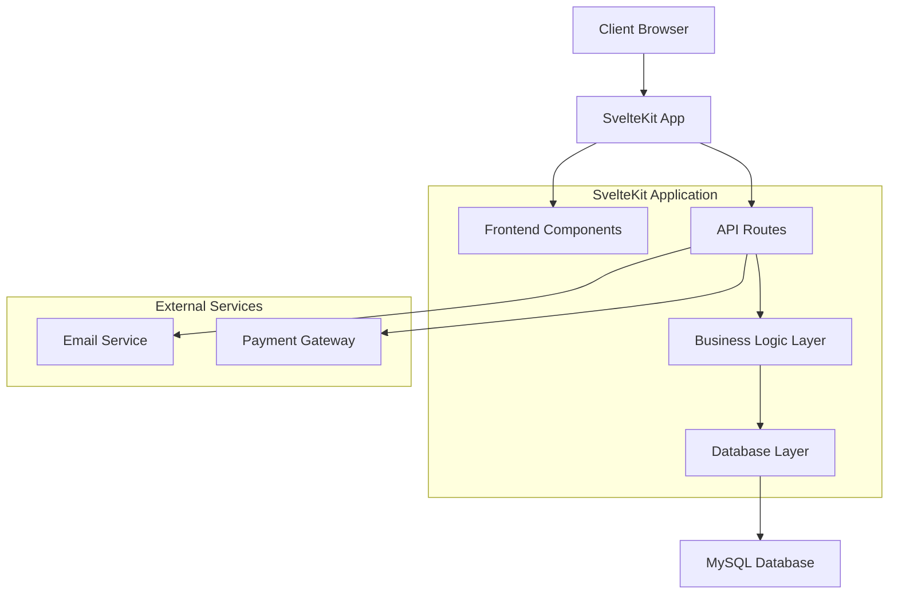
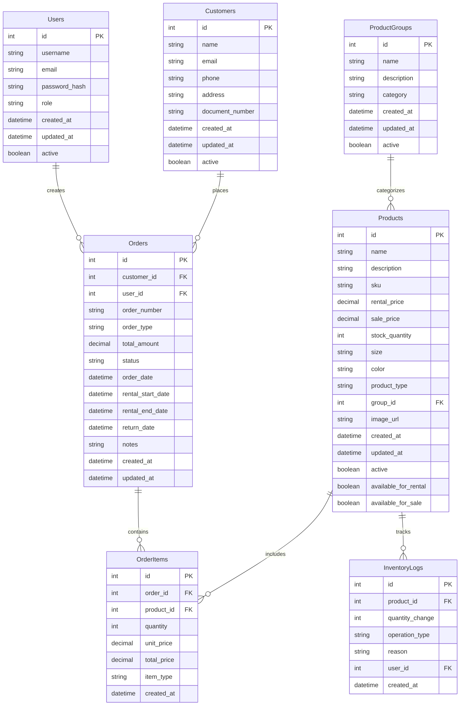
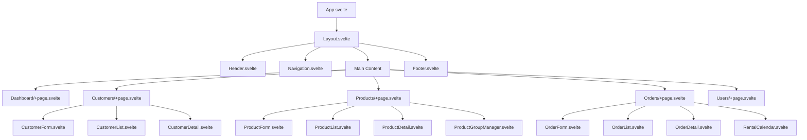
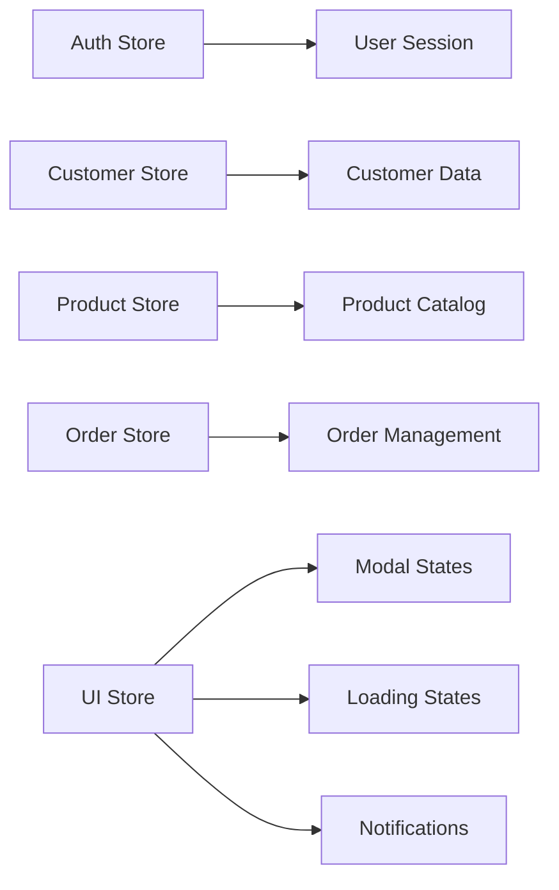
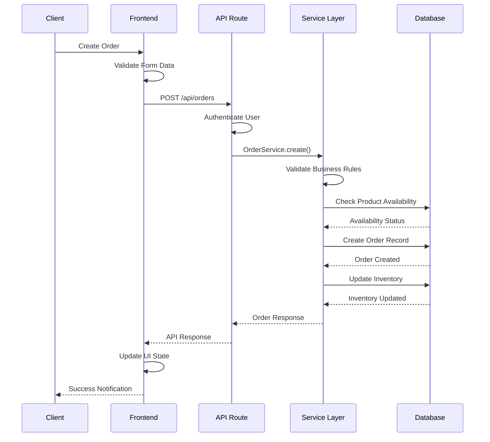
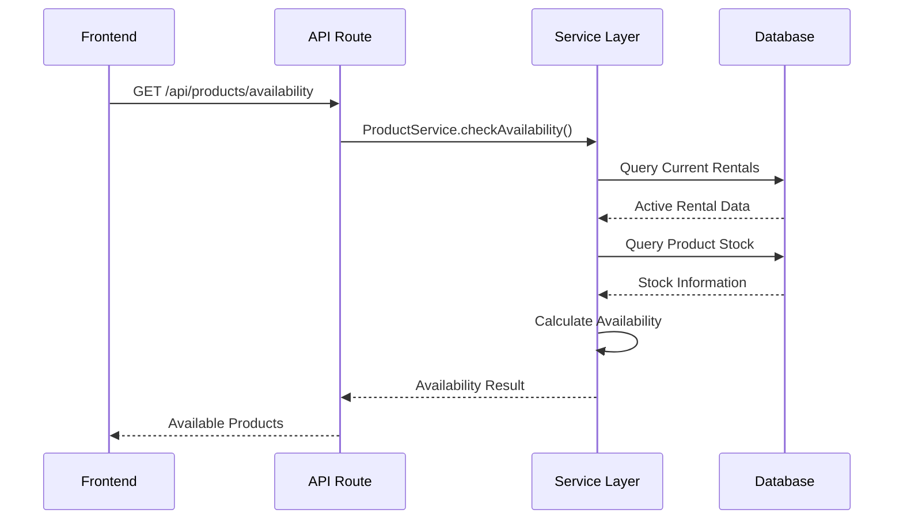

# Fantasy Rental Application - SvelteKit & MySQL

## Overview

A comprehensive full-stack application built with SvelteKit for managing fantasy costume rentals and accessories sales. The system provides complete management of customers, products, product groups, and users with MySQL database persistence.

### Core Features
- Customer registration and management
- Fantasy costume rental system
- Accessories sales functionality
- Product catalog with group categorization
- User management and authentication
- Inventory tracking
- Order processing and management

### Technology Stack
- **Frontend**: SvelteKit with TypeScript
- **Backend**: SvelteKit API routes
- **Database**: MySQL
- **ORM**: Prisma
- **Authentication**: JWT tokens
- **Styling**: Tailwind CSS
- **State Management**: Svelte stores

## Architecture

### System Architecture



### Database Architecture



## Frontend Architecture

### Component Hierarchy



### Key Components

#### CustomerForm.svelte
- Customer registration and editing
- Form validation
- Address management
- Document validation

#### ProductForm.svelte
- Product creation and editing
- Image upload functionality
- Group assignment
- Pricing configuration

#### OrderForm.svelte
- Order creation wizard
- Product selection
- Rental date picker
- Price calculation

#### RentalCalendar.svelte
- Visual rental scheduling
- Availability checking
- Conflict detection

### State Management



### Routing Structure

```
/
├── /auth
│   ├── /login
│   └── /register
├── /dashboard
├── /customers
│   ├── /new
│   └── /[id]
│       └── /edit
├── /products
│   ├── /new
│   ├── /groups
│   └── /[id]
│       └── /edit
├── /orders
│   ├── /new
│   ├── /rental
│   ├── /sale
│   └── /[id]
│       ├── /edit
│       └── /return
└── /users
    ├── /new
    └── /[id]
        └── /edit
```

## Backend Architecture

### API Endpoints Reference

#### Authentication Endpoints
| Method | Endpoint | Description | Auth Required |
|--------|----------|-------------|---------------|
| POST | `/api/auth/login` | User login | No |
| POST | `/api/auth/logout` | User logout | Yes |
| GET | `/api/auth/me` | Get current user | Yes |

#### Customer Management
| Method | Endpoint | Description | Auth Required |
|--------|----------|-------------|---------------|
| GET | `/api/customers` | List customers | Yes |
| POST | `/api/customers` | Create customer | Yes |
| GET | `/api/customers/[id]` | Get customer details | Yes |
| PUT | `/api/customers/[id]` | Update customer | Yes |
| DELETE | `/api/customers/[id]` | Delete customer | Yes |

#### Product Management
| Method | Endpoint | Description | Auth Required |
|--------|----------|-------------|---------------|
| GET | `/api/products` | List products | Yes |
| POST | `/api/products` | Create product | Yes |
| GET | `/api/products/[id]` | Get product details | Yes |
| PUT | `/api/products/[id]` | Update product | Yes |
| DELETE | `/api/products/[id]` | Delete product | Yes |
| GET | `/api/products/availability` | Check availability | Yes |

#### Product Groups
| Method | Endpoint | Description | Auth Required |
|--------|----------|-------------|---------------|
| GET | `/api/groups` | List product groups | Yes |
| POST | `/api/groups` | Create group | Yes |
| PUT | `/api/groups/[id]` | Update group | Yes |
| DELETE | `/api/groups/[id]` | Delete group | Yes |

#### Order Management
| Method | Endpoint | Description | Auth Required |
|--------|----------|-------------|---------------|
| GET | `/api/orders` | List orders | Yes |
| POST | `/api/orders` | Create order | Yes |
| GET | `/api/orders/[id]` | Get order details | Yes |
| PUT | `/api/orders/[id]` | Update order | Yes |
| POST | `/api/orders/[id]/return` | Process return | Yes |

#### User Management
| Method | Endpoint | Description | Auth Required |
|--------|----------|-------------|---------------|
| GET | `/api/users` | List users | Yes (Admin) |
| POST | `/api/users` | Create user | Yes (Admin) |
| PUT | `/api/users/[id]` | Update user | Yes (Admin) |
| DELETE | `/api/users/[id]` | Delete user | Yes (Admin) |

### Data Models & Database Schema

#### User Model
```typescript
interface User {
  id: number;
  username: string;
  email: string;
  passwordHash: string;
  role: 'admin' | 'manager' | 'employee';
  createdAt: Date;
  updatedAt: Date;
  active: boolean;
}
```

#### Customer Model
```typescript
interface Customer {
  id: number;
  name: string;
  email: string;
  phone: string;
  address: string;
  documentNumber: string;
  createdAt: Date;
  updatedAt: Date;
  active: boolean;
}
```

#### Product Model
```typescript
interface Product {
  id: number;
  name: string;
  description: string;
  sku: string;
  rentalPrice: number;
  salePrice: number;
  stockQuantity: number;
  size: string;
  color: string;
  productType: 'fantasy' | 'accessory';
  groupId: number;
  imageUrl: string;
  createdAt: Date;
  updatedAt: Date;
  active: boolean;
  availableForRental: boolean;
  availableForSale: boolean;
}
```

#### Order Model
```typescript
interface Order {
  id: number;
  customerId: number;
  userId: number;
  orderNumber: string;
  orderType: 'rental' | 'sale';
  totalAmount: number;
  status: 'pending' | 'confirmed' | 'delivered' | 'returned' | 'cancelled';
  orderDate: Date;
  rentalStartDate?: Date;
  rentalEndDate?: Date;
  returnDate?: Date;
  notes: string;
  createdAt: Date;
  updatedAt: Date;
  items: OrderItem[];
}
```

### Business Logic Layer

#### Customer Service
- Customer registration and validation
- Customer search and filtering
- Customer profile management
- Customer order history

#### Product Service
- Product catalog management
- Inventory tracking
- Availability checking
- Group categorization
- Price management

#### Order Service
- Order creation and processing
- Rental scheduling
- Return processing
- Payment integration
- Order status management

#### Authentication Service
- User login/logout
- JWT token management
- Role-based access control
- Session management

### Middleware & Security

#### Authentication Middleware
```typescript
// Validates JWT tokens and user sessions
export async function authenticate(event) {
  const token = event.cookies.get('auth-token');
  if (!token) {
    throw redirect(302, '/auth/login');
  }
  // Validate token and set user context
}
```

#### Authorization Middleware
```typescript
// Role-based access control
export function authorize(roles: string[]) {
  return (event) => {
    if (!roles.includes(event.locals.user.role)) {
      throw error(403, 'Insufficient permissions');
    }
  };
}
```

#### Validation Middleware
```typescript
// Input validation and sanitization
export function validateSchema(schema) {
  return async (event) => {
    const data = await event.request.json();
    return schema.parse(data);
  };
}
```

## Data Flow Between Layers

### Order Creation Flow



### Product Availability Check



## Testing

### Unit Testing Strategy

#### Frontend Testing
- Component testing with Vitest and Testing Library
- Store testing for state management
- Form validation testing
- Mock API responses

#### Backend Testing
- API route testing
- Service layer unit tests
- Database integration tests
- Authentication middleware tests

#### Test Structure
```
tests/
├── unit/
│   ├── components/
│   ├── stores/
│   ├── services/
│   └── utils/
├── integration/
│   ├── api/
│   └── database/
└── e2e/
    ├── customer-flow.test.ts
    ├── order-flow.test.ts
    └── admin-flow.test.ts
```

#### Key Test Scenarios
1. Customer registration and management
2. Product catalog operations
3. Order creation and processing
4. Rental scheduling and returns
5. User authentication and authorization
6. Inventory tracking
7. Data validation and error handling