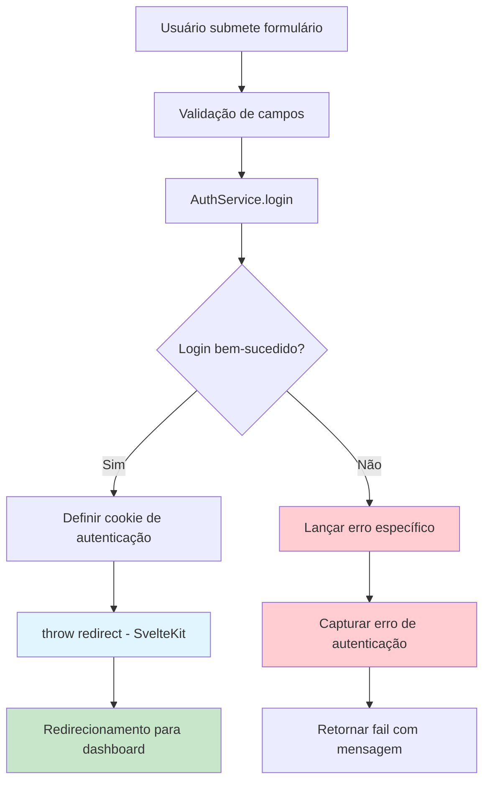

# Design: Correção do Problema de Redirecionamento no Login

## 1. Visão Geral

### Problema Identificado
O sistema de autenticação no arquivo `auth/login/+page.server.ts` está apresentando um comportamento incorreto onde o `throw redirect(302, redirectTo)` está sendo capturado pelo bloco `catch`, fazendo com que a autenticação sempre retorne erro mesmo quando as credenciais estão corretas.

### Causa Raiz
O problema ocorre porque no SvelteKit, o `redirect()` utiliza internamente uma exceção para interromper o fluxo de execução e realizar o redirecionamento. Esta exceção está sendo capturada pelo bloco `catch` genérico, tratando o redirecionamento como um erro de autenticação.

### Solução Proposta
Implementar um tratamento de exceções mais específico que diferencia entre erros reais de autenticação e redirecionamentos intencionais do SvelteKit.

## 2. Arquitetura da Solução

### Fluxo de Autenticação Corrigido



### Tipos de Exceções Identificadas

| Tipo | Origem | Tratamento |
|------|--------|------------|
| `redirect()` | SvelteKit (função de redirecionamento) | Permitir propagação |
| `AuthService.login()` | Credenciais inválidas ou erro de BD | Capturar e retornar fail() |
| Outras exceções | Erros inesperados do sistema | Capturar e log de erro |

## 3. Implementação da Correção

### 3.1. Análise do Código Atual

**Problema no código existente:**
```typescript
try {
    const result = await AuthService.login({ email, password });
    // ... configuração do cookie
    throw redirect(302, redirectTo); // ← Capturado pelo catch
} catch (error) {
    return fail(401, { /* ... */ }); // ← Trata redirect como erro
}
```

### 3.2. Solução Implementada

**Código corrigido com tratamento específico:**
```typescript
try {
    const result = await AuthService.login({ email, password });
    
    // Configurar cookie de autenticação
    cookies.set('auth-token', result.token, {
        path: '/',
        httpOnly: true,
        secure: process.env.NODE_ENV === 'production',
        sameSite: 'lax',
        maxAge: 60 * 60 * 24
    });
    
    // Redirecionamento (fora do try-catch)
    const redirectTo = url.searchParams.get('redirectTo') || '/dashboard/';
    throw redirect(302, redirectTo);
    
} catch (error) {
    // Verificar se é um redirecionamento do SvelteKit
    if (error?.status === 302) {
        throw error; // Re-lançar redirecionamentos
    }
    
    // Tratar apenas erros reais de autenticação
    return fail(401, {
        error: error instanceof Error ? error.message : 'Erro interno do servidor',
        email
    });
}
```

### 3.3. Abordagem Alternativa (Recomendada)

**Reestruturação do fluxo sem try-catch para redirecionamento:**
```typescript
// Validação de entrada
if (!email || !password) {
    return fail(400, {
        error: 'Email e senha são obrigatórios',
        email
    });
}

// Autenticação isolada
let authResult;
try {
    authResult = await AuthService.login({ email, password });
} catch (error) {
    return fail(401, {
        error: error instanceof Error ? error.message : 'Erro interno do servidor',
        email
    });
}

// Configuração do cookie e redirecionamento (fora do try-catch)
cookies.set('auth-token', authResult.token, {
    path: '/',
    httpOnly: true,
    secure: process.env.NODE_ENV === 'production',
    sameSite: 'lax',
    maxAge: 60 * 60 * 24
});

const redirectTo = url.searchParams.get('redirectTo') || '/dashboard/';
throw redirect(302, redirectTo);
```

## 4. Melhorias de Robustez

### 4.1. Validação de URL de Redirecionamento

```typescript
// Validar redirectTo para prevenir redirecionamentos maliciosos
const redirectTo = url.searchParams.get('redirectTo') || '/dashboard/';
const isValidRedirect = redirectTo.startsWith('/') && !redirectTo.startsWith('//');
const safeRedirectTo = isValidRedirect ? redirectTo : '/dashboard/';
```

### 4.2. Logging de Erros

```typescript
catch (error) {
    // Log para depuração em desenvolvimento
    if (process.env.NODE_ENV === 'development') {
        console.error('Login error:', error);
    }
    
    return fail(401, {
        error: error instanceof Error ? error.message : 'Erro interno do servidor',
        email
    });
}
```

### 4.3. Verificação de Estado do Usuário

```typescript
// No AuthService.login, adicionar verificações extras
static async login(credentials: LoginCredentials) {
    const { email, password } = credentials;

    const user = await prisma.user.findUnique({
        where: { email, active: true }
    });

    if (!user) {
        throw new Error('Credenciais inválidas');
    }

    // Verificação adicional de status
    if (!user.active) {
        throw new Error('Conta inativa. Contate o administrador.');
    }

    const isValidPassword = await bcrypt.compare(password, user.passwordHash);
    if (!isValidPassword) {
        throw new Error('Credenciais inválidas');
    }

    // ... resto do código
}
```

## 5. Testes da Solução

### 5.1. Casos de Teste para Form Action

```typescript
// Teste de login bem-sucedido com redirecionamento
test('deve redirecionar após login bem-sucedido', async () => {
    // Mock do AuthService.login
    // Simular request com dados válidos
    // Verificar se redirect() foi chamado
    // Verificar cookie definido
});

// Teste de erro de autenticação
test('deve retornar fail() para credenciais inválidas', async () => {
    // Mock do AuthService.login com erro
    // Verificar retorno de fail(401)
    // Verificar que não houve redirecionamento
});
```

### 5.2. Teste de Integração

```typescript
// Teste end-to-end do fluxo de login
test('fluxo completo de autenticação', async () => {
    // Submeter formulário com credenciais válidas
    // Verificar redirecionamento para /dashboard
    // Verificar cookie de autenticação definido
    // Verificar que usuário está autenticado
});
```

## 6. Considerações de Segurança

### 6.1. Validação de Redirecionamento
- Permitir apenas URLs internas (começando com `/`)
- Prevenir redirecionamentos abertos (open redirect vulnerabilities)
- Validar domínio de destino em ambientes de produção

### 6.2. Tratamento de Erros
- Não vazar informações sensíveis em mensagens de erro
- Implementar rate limiting para tentativas de login
- Log de tentativas de login para auditoria

### 6.3. Configuração de Cookies
- `httpOnly: true` - Previne acesso via JavaScript
- `secure: true` em produção - Apenas HTTPS
- `sameSite: 'lax'` - Proteção CSRF básica
- Tempo de expiração apropriado (24h)

## 7. Impacto da Mudança

### 7.1. Compatibilidade
- ✅ Não quebra funcionalidade existente
- ✅ Melhora experiência do usuário
- ✅ Mantém padrões de segurança

### 7.2. Performance
- ✅ Sem impacto negativo na performance
- ✅ Reduz processamento desnecessário de erros
- ✅ Fluxo mais direto de autenticação

### 7.3. Manutenibilidade
- ✅ Código mais claro e compreensível
- ✅ Separação clara entre autenticação e redirecionamento
- ✅ Facilita debugging e testes