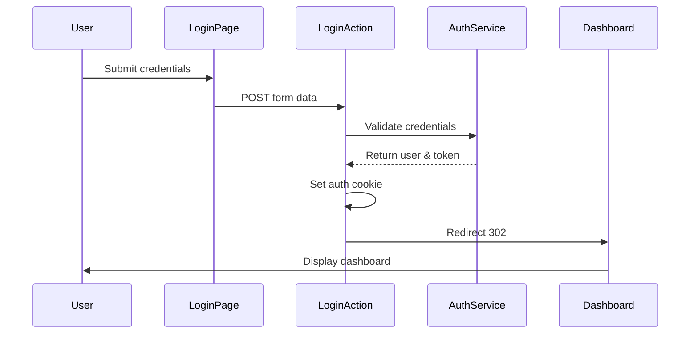
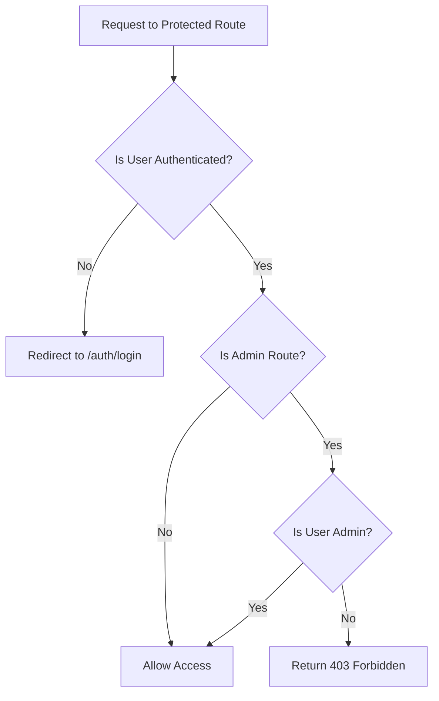

# Authentication Redirection Fix Design

## Overview

The SvelteKit application is experiencing a 404 error after successful login validation. Users can authenticate with correct credentials, but the redirection to the dashboard fails, resulting in a 404 page not found error.

## Root Cause Analysis

### Primary Issues Identified

1. **Typo in Login Action Name**: The login form action has a typo `tdefault` instead of `default`
2. **Type Mismatch in Dashboard Load Function**: Using `PageLoad` instead of `PageServerLoad` in server-side file
3. **Property Name Typo**: Error property has typo `terror` instead of `error`

### Code Issues Found

```typescript
// File: src/routes/auth/login/+page.server.ts
export const actions: Actions = {
    tdefault: async ({ request, cookies, url }) => {  // ❌ Should be 'default'
        // ...
        return fail(400, {
            terror: 'Email e senha são obrigatórios',  // ❌ Should be 'error'
            email
        });
    }
};
```

```typescript
// File: src/routes/dashboard/+page.server.ts
import type { PageLoad } from './$types';  // ❌ Should be PageServerLoad

export const load: PageLoad = async () => {  // ❌ Should be PageServerLoad
```

## Solution Architecture

### Authentication Flow Diagram



### Route Protection Flow



## Technical Fixes Required

### 1. Fix Login Action Name and Error Property

**File**: `src/routes/auth/login/+page.server.ts`

**Changes**:
- Fix action name from `tdefault` to `default`
- Fix error property from `terror` to `error`

### 2. Fix Dashboard Load Function Type

**File**: `src/routes/dashboard/+page.server.ts`

**Changes**:
- Change import from `PageLoad` to `PageServerLoad`
- Update function signature accordingly

### 3. Verify Route Structure

**Protected Routes**:
- `/dashboard` - Main dashboard
- `/customers` - Customer management
- `/products` - Product management  
- `/orders` - Order management
- `/users` - User management (Admin only)

## Implementation Details

### Authentication State Management

| Component | Responsibility |
|-----------|---------------|
| `hooks.server.ts` | Route protection middleware |
| `+layout.ts` | User session loading |
| `auth.ts` store | Client-side auth state |
| Login action | Server-side authentication |

### Cookie Configuration

```typescript
cookies.set('auth-token', result.token, {
    path: '/',
    httpOnly: true,
    secure: process.env.NODE_ENV === 'production',
    sameSite: 'lax',
    maxAge: 60 * 60 * 24 // 24 hours
});
```

### Redirection Logic

1. **After Login**: Redirect to `redirectTo` parameter or `/dashboard`
2. **Unauthenticated Access**: Redirect to `/auth/login`
3. **Already Authenticated**: Redirect away from login page

## Testing Strategy

### Unit Tests Required

1. **Login Action Tests**
   - Test successful authentication
   - Test invalid credentials
   - Test missing fields
   - Test redirection behavior

2. **Dashboard Load Tests**
   - Test data loading
   - Test error handling
   - Test authentication requirement

3. **Route Protection Tests**
   - Test unauthorized access
   - Test admin route protection
   - Test cookie validation

### Integration Test Scenarios

| Scenario | Expected Outcome |
|----------|------------------|
| Valid login credentials | Redirect to dashboard |
| Invalid credentials | Stay on login with error |
| Access dashboard without auth | Redirect to login |
| Access admin route as non-admin | 403 Forbidden |

## Error Handling

### Client-Side Error Display

```typescript
// Form validation errors
$: email = form?.email || '';
$: error = form?.error || '';
```

### Server-Side Error Responses

- **400 Bad Request**: Missing or invalid fields
- **401 Unauthorized**: Invalid credentials
- **403 Forbidden**: Insufficient permissions
- **500 Internal Server Error**: Database/server errors

## Security Considerations

### JWT Token Security

- Stored in HTTP-only cookies
- Secure flag in production
- SameSite protection
- 24-hour expiration

### Route Protection

- Server-side middleware validation
- Role-based access control
- Automatic cookie cleanup on invalid tokens

## Post-Implementation Verification

### Verification Checklist

- [ ] Login form submits successfully
- [ ] Valid credentials redirect to dashboard
- [ ] Invalid credentials show error message
- [ ] Dashboard loads with user data
- [ ] Protected routes require authentication
- [ ] Admin routes require admin role
- [ ] Logout clears session properly

### Manual Testing Steps

1. Navigate to login page
2. Enter valid credentials
3. Verify redirect to dashboard
4. Verify dashboard data loads
5. Test logout functionality
6. Test direct access to protected routes